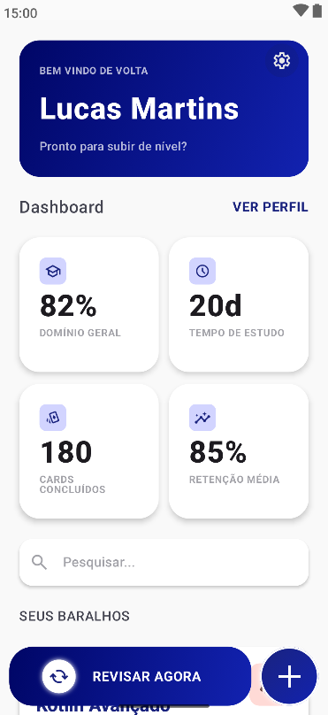
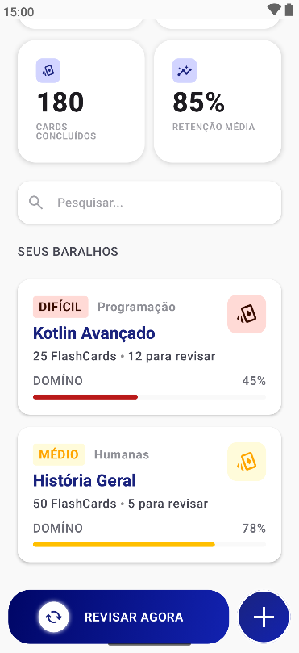
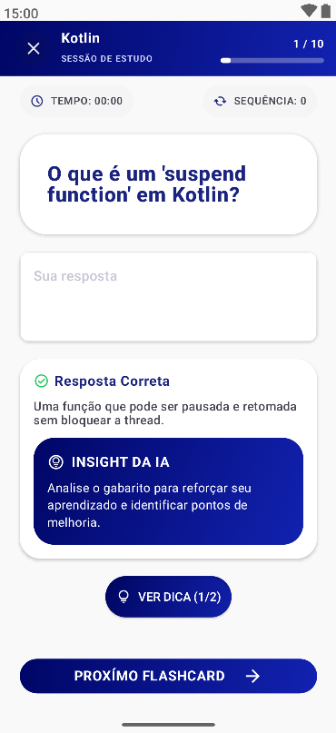
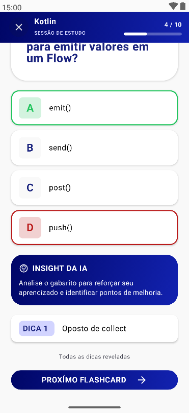
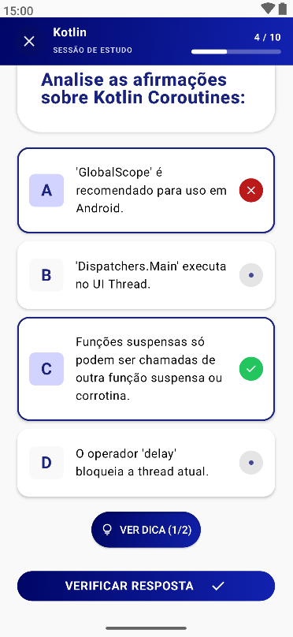
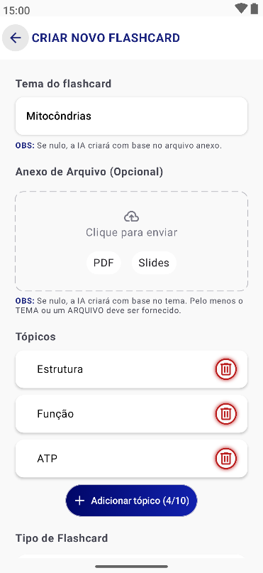
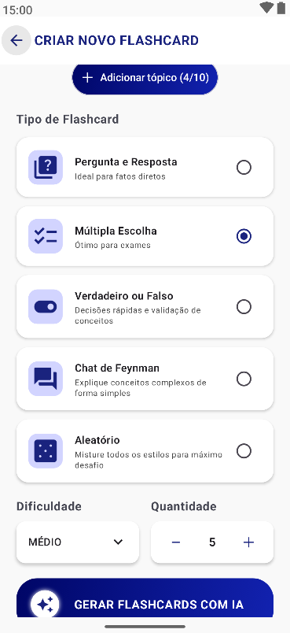

# 📱 CogniLink

O **CogniLink** é um ecossistema de aprendizado inteligente projetado para maximizar a retenção de conhecimento através da integração de inteligência artificial, repetição espaçada e geolocalização.

---

# 📖 Sobre o Projeto

O aprendizado eficiente é um desafio constante na era da sobrecarga de informação. O CogniLink surge como uma solução robusta para estudantes e profissionais que buscam otimizar seu tempo de estudo.

### O Contexto e o Problema
Muitos estudantes enfrentam a "curva do esquecimento" e a dificuldade em organizar materiais de estudo de forma produtiva. A criação manual de flashcards é trabalhosa, e a falta de contexto ou lembretes oportunos interrompe frequentemente a rotina de estudos.

### Objetivos e Motivação
- **Automação Inteligente:** Utilizar IA para gerar materiais de estudo a partir de documentos (PDF/Texto).
- **Retenção de Longo Prazo:** Implementar o algoritmo **SM-2** para otimizar os intervalos de revisão.
- **Contextualização:** Usar **Geofencing** para enviar notificações de estudo baseadas na localização do usuário (ex: ao chegar na biblioteca ou universidade).
- **Aprendizado Ativo:** Integrar um chat baseado na **Técnica de Feynman**, aonde a IA atua como um tutor que desafia o usuário a explicar conceitos com simplicidade.

---

# ✨ Funcionalidades

- **Gerenciamento de Baralhos:** Organização de flashcards por temas e categorias.
- **Repetição Espaçada (Spaced Repetition):** Algoritmo SM-2 integrado para priorizar cartas que o usuário tem mais dificuldade.
- **Geração de Flashcards com IA:** Upload de documentos para criação automática de questões e respostas.
- **Tutor de Feynman:** Chat interativo com IA para validação de compreensão de temas complexos.
- **Geofencing Educacional:** Notificações automáticas baseadas em localização para incentivar o estudo em ambientes propícios.
- **Sistema de Ranks e Estatísticas:** Acompanhamento detalhado do progresso e desempenho do usuário.
- **Persistência Offline:** Sincronização local com Room para estudos sem internet.
- **Autenticação Segura:** Gestão de usuários via Firebase Auth.

---

# 🏛 Arquitetura

O projeto utiliza **Clean Architecture** combinada com o padrão **MVVM (Model-View-ViewModel)**, garantindo testabilidade, manutenibilidade e baixo acoplamento.

### Organização das Camadas
1.  **Data Layer:** Responsável pela persistência (Room) e comunicação externa (Ktor/Firebase). Contém implementações de repositórios e serviços.
2.  **Domain Layer:** A "alma" do negócio. Contém as entidades, interfaces de repositórios e os Casos de Uso (Use Cases). Não possui dependências de framework.
3.  **Presentation (UI) Layer:** Implementada com **Jetpack Compose**. Gerencia o estado da interface através de ViewModels.

### Estrutura de Pastas
```
app/src/main/java/com/lucasdpm/cognilink/
├── data/               # Implementação de Repositórios, DAOs, Entidades e Serviços
│   ├── database/       # Configuração do Room (Entities, DAOs, Database)
│   ├── mappers/        # Conversores entre modelos de dados e domínio
│   ├── repository/     # Implementações concretas dos repositórios
│   └── service/        # Ktor API, Geofencing, Monitoramento de Rede
├── domain/             # Lógica de Negócio (Independente de Frameworks)
│   ├── model/          # Modelos de domínio puro
│   ├── repository/     # Interfaces dos repositórios e serviços
│   └── usecase/        # Casos de uso da aplicação
├── ui/                 # Camada de Apresentação (Jetpack Compose)
│   ├── screens/        # Telas completas da aplicação
│   ├── components/     # UI Components reutilizáveis (botões, inputs, etc)
│   ├── theme/          # Definições de cores, tipografia e formas
│   ├── states/         # Definições de UiState para cada tela
│   ├── navigation/     # Configuração de rotas e NavGraph
│   └── viewmodels/     # ViewModels e gerenciamento de estado (MVVM)
├── di/                 # Módulos de Injeção de Dependência (Koin)
├── CogniLinkApplication.kt # Configuração da aplicação e Koin
└── MainActivity.kt     # Atividade principal e Navegação
```

---

# 🛠 Tecnologias Utilizadas

| Tecnologia            | Uso                                                     |
|-----------------------|---------------------------------------------------------|
| **Kotlin**            | Linguagem de programação moderna e concisa.             |
| **Jetpack Compose**   | Toolkit moderno para construção de UI nativa.           |
| **Room**              | Abstração sobre SQLite para persistência local robusta. |
| **Koin**              | Framework leve para Injeção de Dependência.             |
| **Ktor Client**       | Comunicação assíncrona com APIs de IA e Backend.        |
| **Firebase**          | Autenticação (Auth) e armazenamento remoto (Firestore). |
| **Coroutines & Flow** | Gestão de operações assíncronas e reatividade.          |
| **SM-2 Algorithm**    | Lógica matemática para repetição espaçada.              |
| **Google Maps API**   | Implementação de Geofencing para localização.           |

---

# 📦 Bibliotecas Principais

- `io.insert-koin:koin-android`: Injeção de dependência simplificada.
- `io.ktor:ktor-client-android`: Cliente HTTP para requisições à API de IA.
- `androidx.room:room-ktx`: Banco de dados local com suporte a Coroutines.
- `androidx.navigation:navigation-compose`: Navegação moderna entre telas.
- `com.google.android.gms:play-services-location`: Gerenciamento de geofences e localização.
- `org.jetbrains.kotlinx:kotlinx-serialization`: Serialização JSON performática.

---

# 📱 Telas do Aplicativo

- **Home:** Dashboard com resumo de estudos do dia e baralhos recentes.
- **Baralhos:** Lista completa de baralhos criados pelo usuário.
- **Deck Editor:** Interface para configurar o nome e propriedades de um deck.
- **Flashcard Editor:** Interface dedicada para criar e editar flashcards manualmente, permitindo definir pergunta, resposta e tipo de card.
- **Study Session:** O ambiente de revisão onde o SM-2 entra em ação. Inclui o **Tutor de Feynman** como ferramenta de aprendizado ativo para temas complexos.
- **IA Generation:** Tela de upload de documentos e configuração de tópicos para geração automática.
- **Profile/Settings:** Gestão de perfil, senhas e preferências de notificação/geofencing.

---

# 🔄 Fluxo de Navegação

1.  **Splash/Auth:** O usuário inicia autenticando-se via Firebase.
2.  **Home:** A partir da Home, o usuário navega para a lista de Baralhos.
3.  **Fluxo de Estudo:** Baralhos → Seleção de Baralho → Iniciar Sessão de Estudo → Feedback (SM-2/Feynman).
4.  **Fluxo de IA:** Home → Seleção de Baralho → Botão Add Flashcard → Criar com IA → Upload de Documento → Revisão de Tópicos → Gerar Cards → Salvar no Baralho.

---

# 🗄 Banco de Dados

O CogniLink utiliza o **Room Persistence Library** com a seguinte estratégia:
- **Entidades Principais:** `User`, `Deck`, `Flashcard`, `StudyContext`.
- **Relacionamentos:** Um Baralho possui N Flashcards; Um Usuário possui N Baralhos.
- **Estatísticas:** Tabela de `FlashcardStats` para armazenar o histórico de respostas, facilidade (E-factor) e datas de próxima revisão, fundamentais para o SM-2.

---

# 🌐 Comunicação com APIs

A comunicação é feita via **Ktor Client** com as seguintes características:
- **Base Backend:** URL configurável para o serviço de IA.
- **Endpoints:** `/ai/generate-flashcards`, `/ai/feynman/start`, `/ai/compare-answer`.
- **Segurança:** Autenticação via tokens (Bearer) injetados via interceptores (se aplicável).
- **Tratamento de Erros:** Wrappers de `Result<T>` para lidar com falhas de rede e timeouts de forma resiliente.

---

# ⚙ Requisitos

- **Android Studio:** Ladybug (2024.2.1) ou superior recomendado.
- **Kotlin:** 2.1.0+
- **SDK Mínimo:** 26 (Android 8.0)
- **SDK Alvo:** 37
- **Gradle:** 8.7+

---

# 🚀 Como executar

### 1. Clonar o Repositório
```bash
git clone https://github.com/lucas-dpm/CogniLink.git
cd CogniLink
```

### 2. Configurar o Firebase
- Crie um projeto no [Firebase Console](https://console.firebase.google.com/).
- Adicione um app Android com o package `com.lucasdpm.cognilink`.
- Baixe o `google-services.json` e coloque na pasta `app/`.

### 3. Variáveis de Ambiente
Crie um arquivo `local.properties` na raiz do projeto:
```properties
BASE_BACKEND_URL=https://sua-api-cognilink.com
MAPS_API_KEY=SUA_CHAVE_AQUI
```

### 4. Abrir e Sincronizar
- Abra o projeto no Android Studio.
- Clique em **"Sync Project with Gradle Files"**.

### 5. Executar
- Selecione um emulador ou dispositivo físico (API 26+).
- Clique no botão **Run**.

---

# 📸 Capturas de Tela

## Home e Dashboard
 

## Sessão de Estudo (SM-2 & Feynman)
  

## Geração de Flashcards com IA
 

---

# 🧪 Testes

- **Unitários:** Focados na lógica do algoritmo SM-2 e Use Cases da camada de domínio.
- **Instrumentados:** Testes de fluxo de navegação e integração com banco de dados local.
- **Execução:**
  ```bash
  ./gradlew test        # Testes unitários
  ./gradlew connectedAndroidTest # Testes no dispositivo
  ```

---

# 📈 Melhorias Futuras

- [ ] Suporte a múltiplos idiomas (Internacionalização).
- [ ] Modo Dark completo e dinâmico.
- [ ] Modo offline para o Tutor de Feynman e validação semântica (IA Local/Edge).
- [ ] Gamificação com distintivos e conquistas semanais.

---

# 🤝 Como contribuir

1.  Dê um **Fork** no projeto.
2.  Crie uma **Branch** para sua feature (`git checkout -b feature/nova-funcionalidade`).
3.  Dê um **Commit** em suas alterações (`git commit -m 'Add: nova funcionalidade'`).
4.  Dê um **Push** para a Branch (`git push origin feature/nova-funcionalidade`).
5.  Abra um **Pull Request**.

---

# 👨‍💻 Desenvolvedores

- **Lucas DPM** - Lead Developer - [LinkedIn](https://www.linkedin.com/in/LucasPMartins) | [GitHub](https://github.com/lucas-dpm)

---

# 📄 Licença

Este projeto está sob a licença **MIT**. Veja o arquivo [LICENSE](LICENSE) para mais detalhes.

---

# 🙏 Agradecimentos

- À **UFU** pelo apoio e infraestrutura de pesquisa.
- Aos professores e orientadores do projeto de **Prof. Dr. Alexsandro Santos Soares** e **Prof. Dr. Rafael Dias Araújo**.
- À comunidade Open Source pelas bibliotecas e ferramentas incríveis.

---
*Ano: 2026*
